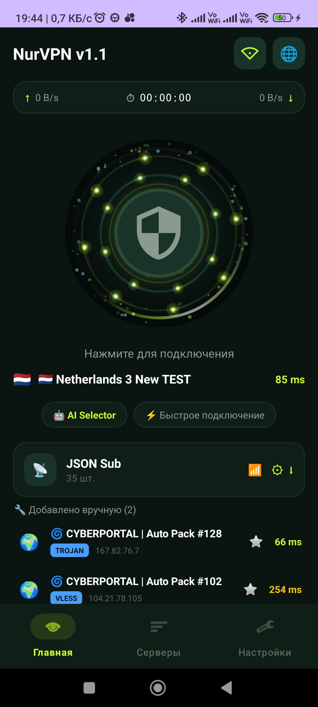
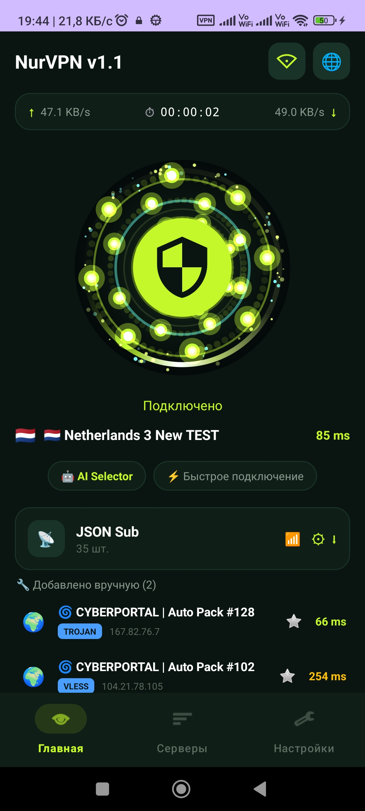
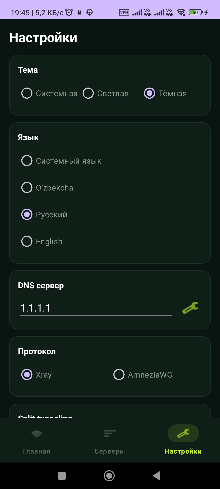
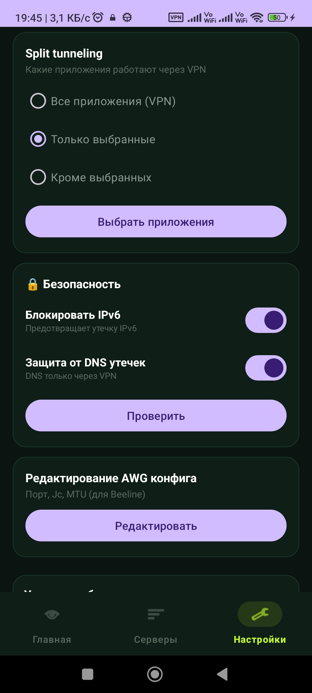
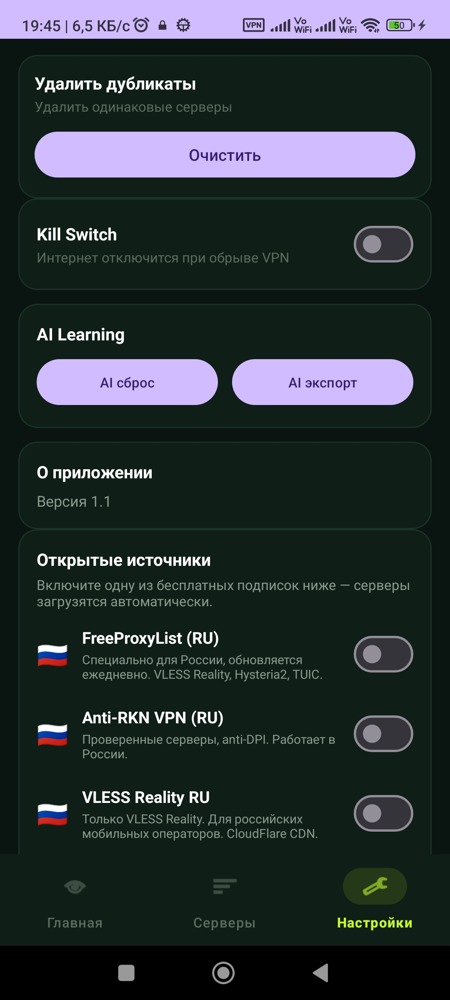
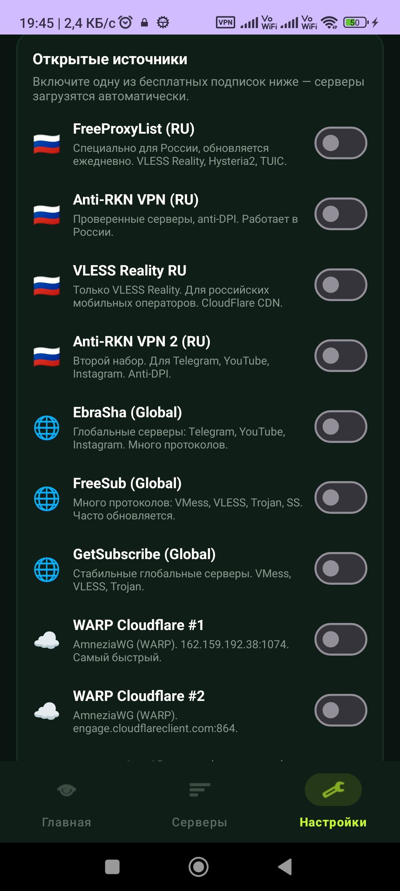

# NurVPN

**Modern VPN client for Android** — Kotlin, Material 3, INCY style.

[English](README.md) | [O'zbekcha](README.uz.md) | [Русский](README.ru.md)

---

> **Note:** I am **not a developer at all** — just someone **interested in this field**. This project was created with the help of **DeepSeek AI** (and other AI assistants) for learning and personal use. Code may contain errors — improvements and pull requests are welcome!

---

## Features

- **6+ protocols**: VLESS Reality, VMess, Trojan, Shadowsocks, Hysteria2, TUIC, AmneziaWG
- **Modern UI** — Material 3, dark-green + lime
- **Real-time traffic** — up/down B/s
- **3 languages**: Uzbek, Russian, English
- **Light/Dark mode**
- **Favorites** — quick connect
- **Ping test** — TCP + ICMP
- **Split Tunneling** — Whitelist/Blacklist
- **DNS leak + IPv6 protection**
- **QR scanner** — scan links and AWG configs
- **QR sharing** — share server, AWG config, or subscription via QR code
- **Open sources** — 10+ free subscriptions (can be fully disabled/removed)
- **AI Selector** — auto-select best server
- **Pause/Resume** — notification panel
- **Quick Settings Tile** — control center

---

## 📸 Screenshots

| Home (VPN off) | Home (VPN on) | Servers |
|:---:|:---:|:---:|
|  |  |  |

| Settings | Security | Open Sources |
|:---:|:---:|:---:|
|  |  |  |

| More Sources | | |
|:---:|:---:|:---:|
|  | | |

---

## Installation

### F-Droid (coming soon)

NurVPN is currently under review for F-Droid. Once approved, you'll find it at:
[F-Droid NurVPN page](https://f-droid.org/packages/com.nurvpn.app/)

### GitHub Releases

### Download APK

1. Go to **Releases** section
2. Download **app-arm64-v8a-release.apk** (modern phones, ~84 MB)
3. Or **app-armeabi-v7a-release.apk** (older phones, 76 MB)
4. Install it

### Build from source

    git clone https://github.com/javoxir5543/NurVPN.git
    cd NurVPN

    chmod +x scripts/get-libbox.sh
    ./scripts/get-libbox.sh
    ./gradlew assembleRelease

---

## Usage

1. Open the app
2. **Settings -> Open sources** -> enable a free subscription
3. Or **+ Add** -> enter your VLESS/VMess/AWG link
4. **Home tab** -> select server
5. **Play** button -> VPN connects

---

## Tech Stack

- **Language**: Kotlin
- **UI**: Material 3, View Binding
- **Core**: sing-box (libbox.aar)
- **QR**: ZXing
- **Min SDK**: 24 (Android 7.0)
- **Target SDK**: 34 (Android 14)

---

## Contributing

Pull requests and issues are welcome!

1. Fork it
2. Create a branch
3. Commit changes
4. Push
5. Open a Pull Request

---

## License

**MIT License** — see [LICENSE](LICENSE) for details.

---

## Author

**Javohir** — [@javoxir5543](https://github.com/javoxir5543)

> I am **not a developer** — just **interested in this field**. Built with help from **DeepSeek AI**.

---

## Credits

- sing-box — VPN core
- ZXing — QR scanner
- **DeepSeek AI** — main development assistant
- All open source subscription owners

If useful — give a star!
