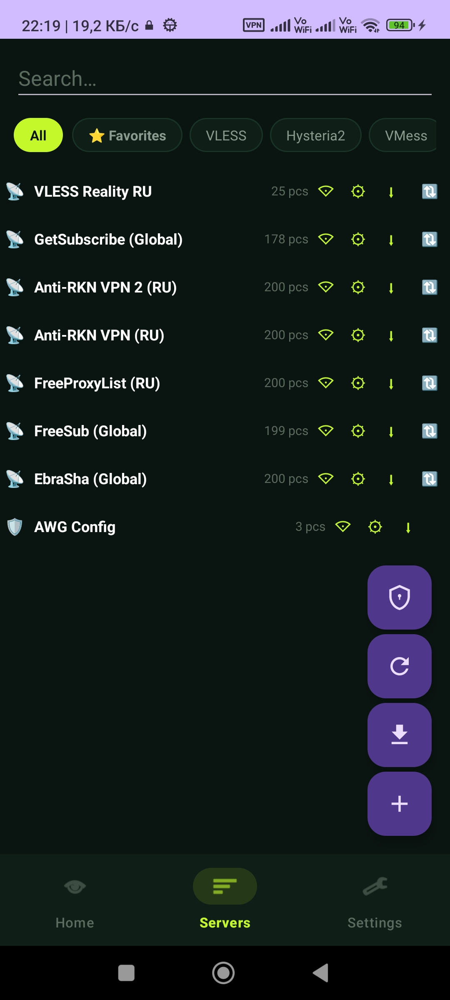
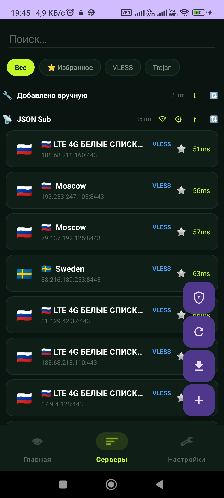
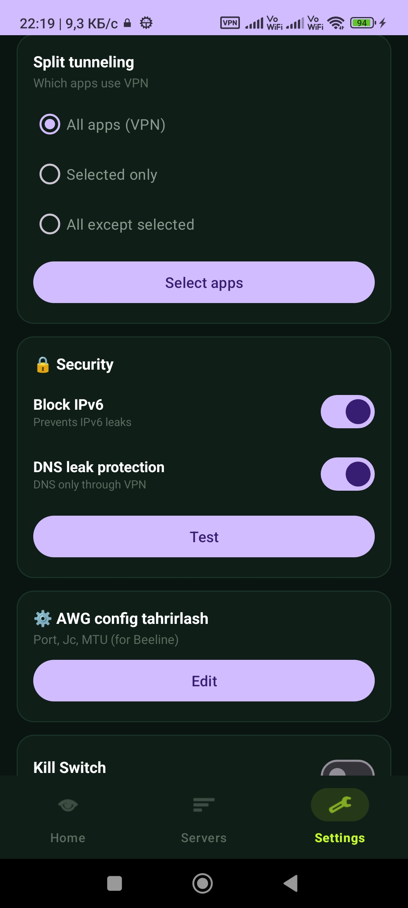
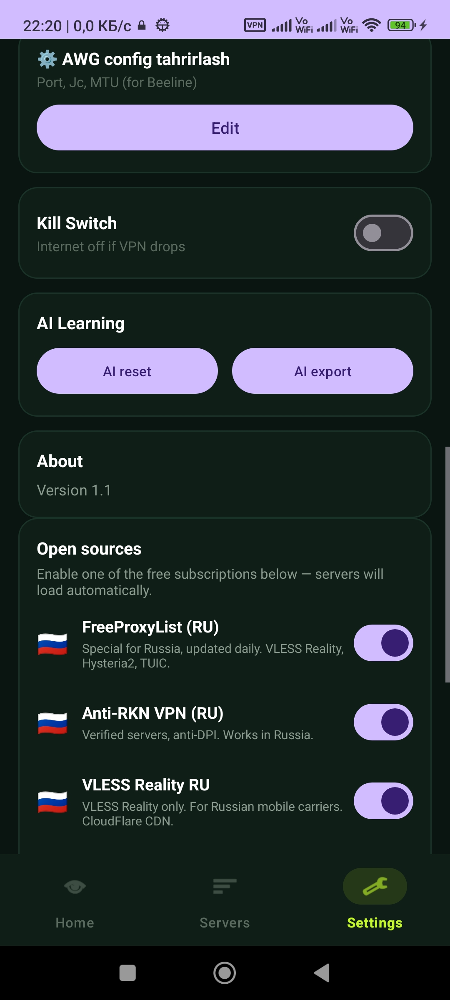
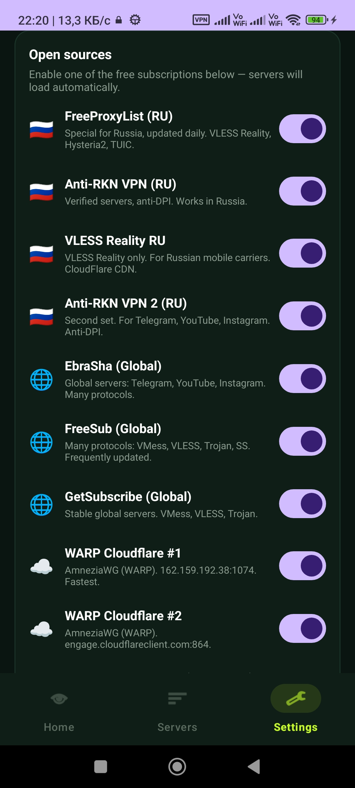

# NurVPN

**Android uchun zamonaviy VPN client** — Kotlin, Material 3, INCY uslubi.

[English](README.md) | [O'zbekcha](README.uz.md) | [Русский](README.ru.md)

---

> **Eslatma:** Men **umuman dasturchi emasman** — bu sohaga **qiziqishim bor**. Bu loyiha **DeepSeek AI** (va boshqa AI yordamchilar) yordamida **o'rganish va shaxsiy foydalanish** uchun yaratilgan. Kodda xatolar yoki optimal bo'lmagan yechimlar bo'lishi mumkin. Pull request va yaxshilanishlar xush kelibsiz!

---

## Xususiyatlar

- **6+ protokol**: VLESS Reality, VMess, Trojan, Shadowsocks, Hysteria2, TUIC, AmneziaWG
- **Zamonaviy UI** — Material 3, qora-yashil + lime
- **Real-time trafik** — yuqoriga/pastga B/s
- **3 til**: O'zbek, Rus, Ingliz
- **Kun/tun rejimi**
- **Sevimlilar** — tez ulanish uchun
- **Ping test** — TCP + ICMP
- **Split Tunneling** — Whitelist/Blacklist
- **DNS leak + IPv6 himoya**
- **QR skaner** — link va AWG config
- **Ochiq manbalar** — 10+ bepul obuna
- **AI Selector** — eng yaxshi server avtomatik tanlash
- **Pauza/Davom etish** — notification panel
- **Quick Settings Tile** — control center

---

## 📸 Skrinshotlar

| Home | Servers | Settings |
|:---:|:---:|:---:|
|  |  |  |

| Security | Open Sources | More Sources |
|:---:|:---:|:---:|
|  |  |  |

---

## O'rnatish

### APK yuklab olish

1. **Releases** bo'limiga o'ting
2. **nurvpn-v1.1.0-arm64-v8a.apk** ni yuklab oling (zamonaviy telefonlar)
3. Yoki **armeabi-v7a.apk** (eski telefonlar)
4. O'rnating

### Manbadan qurish

    git clone https://github.com/javoxir5543/NurVPN.git
    cd NurVPN

    chmod +x scripts/get-libbox.sh
    ./scripts/get-libbox.sh
    ./gradlew assembleRelease

---

## Foydalanish

1. Ilovani oching
2. **Sozlamalar -> Ochiq manbalar** -> bepul obunani yoqing
3. Yoki **+ Qo'shish** -> o'z VLESS/VMess/AWG linkingizni kiriting
4. **Asosiy tab** -> server tanlang
5. **Play** tugmasini bosing -> VPN ulanadi

---

## Texnologiya

- **Til**: Kotlin
- **UI**: Material 3, View Binding
- **Core**: sing-box (libbox.aar)
- **QR**: ZXing
- **Min SDK**: 24 (Android 7.0)
- **Target SDK**: 34 (Android 14)

---

## Hissa qo'shish

Pull request va issue'lar xush kelibsiz!

1. Fork qiling
2. Branch yarating
3. Commit qiling
4. Push qiling
5. Pull Request oching

---

## Litsenziya

**MIT License** — batafsil: [LICENSE](LICENSE)

---

## Muallif

**Javohir** — [@javoxir5543](https://github.com/javoxir5543)

> **Dasturchi emasman** — bu sohaga **qiziqishim bor**. **DeepSeek AI** yordamida yaratilgan.

---

## Rahmat

- sing-box — VPN core
- ZXing — QR skaner
- **DeepSeek AI** — asosiy yordamchi
- Barcha ochiq manba obuna egalariga

Agar foydali bo'lsa — star bosing!
